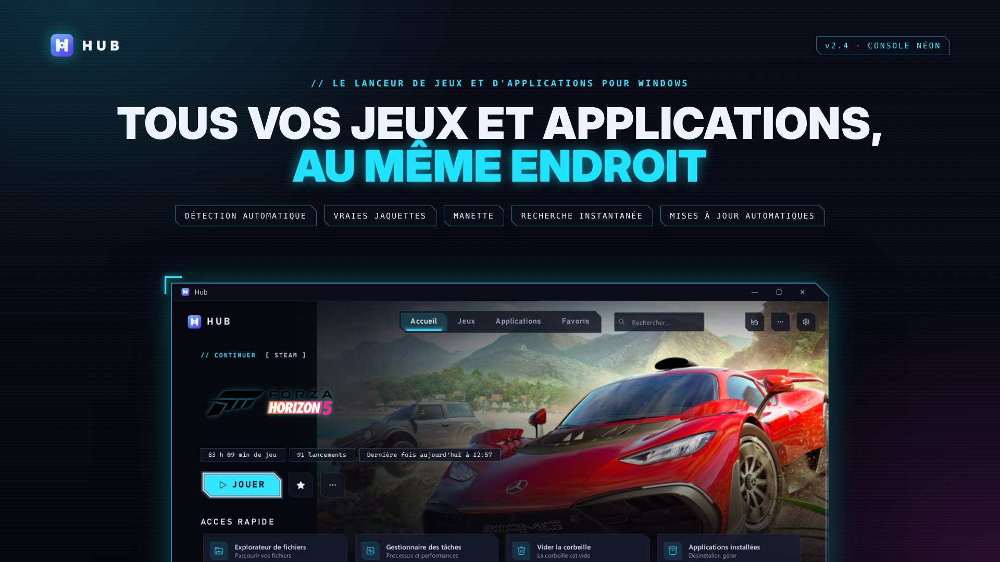
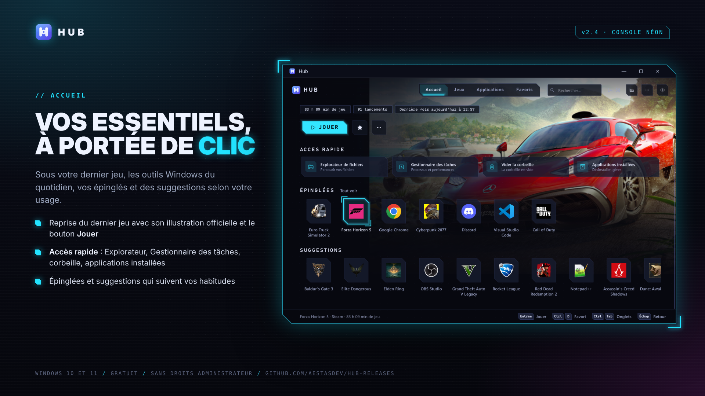
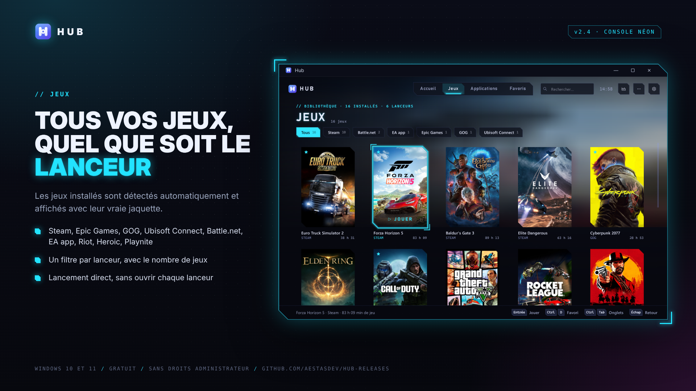
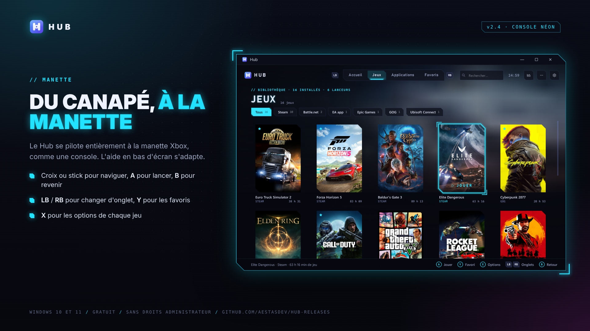
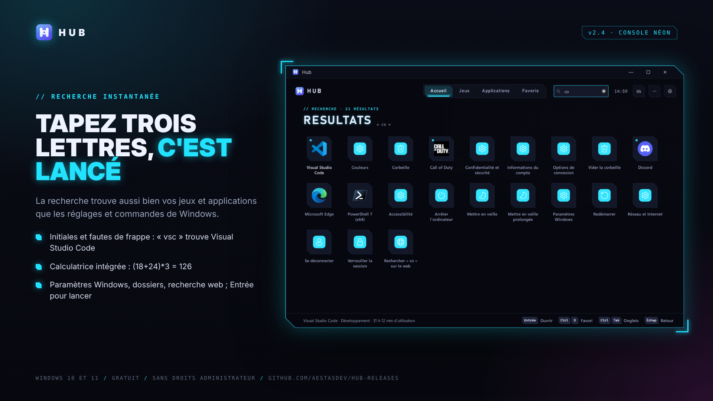
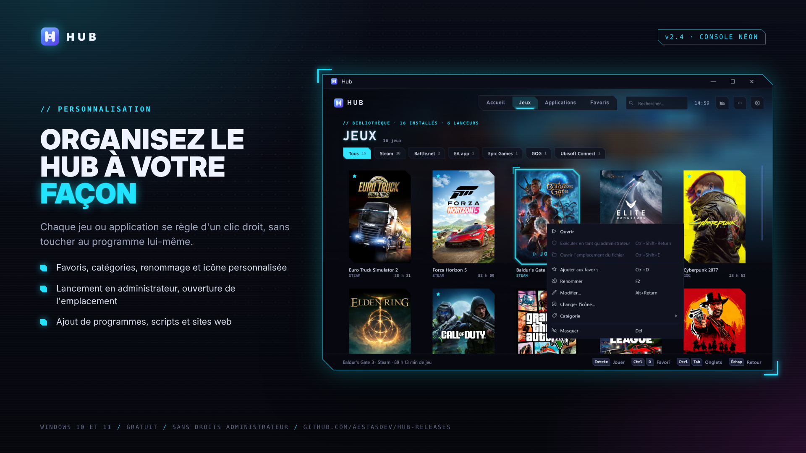
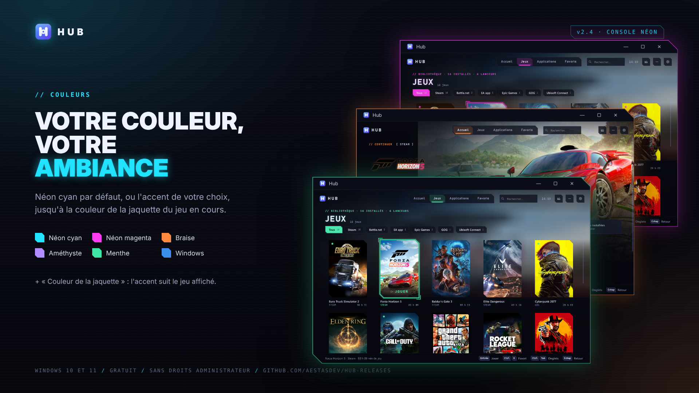
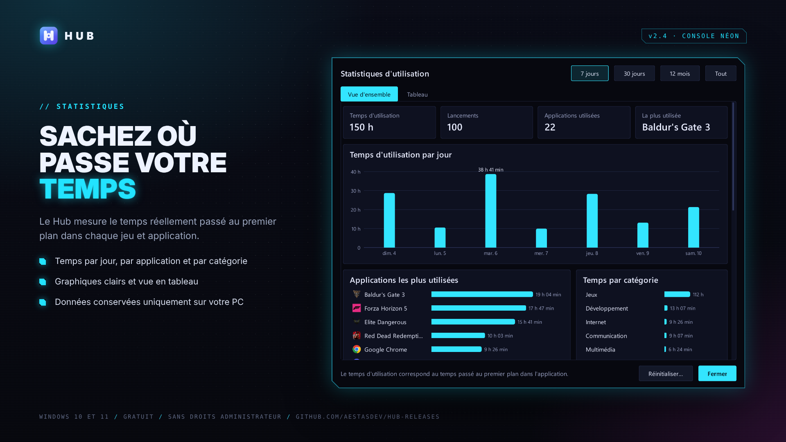
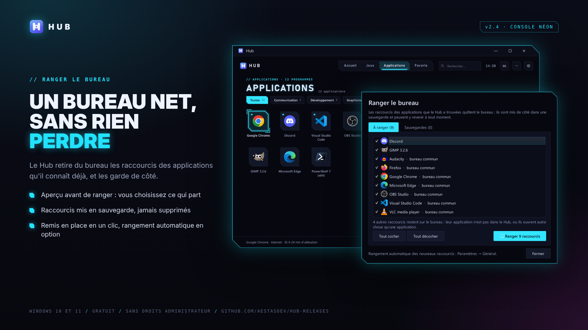
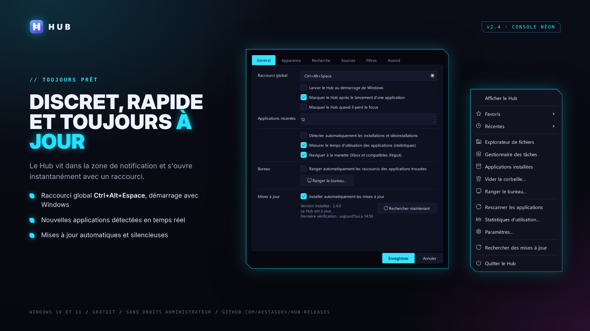

  

<h1 align="center">Hub</h1>

  <b>Toutes vos applications et vos jeux, au même endroit.</b> 
  Un lanceur rapide et élégant pour Windows 10 et 11.

  <a href="https://github.com/AestasDev/HUB-releases/releases/latest"><b>⬇ Télécharger la dernière version</b></a>

## Fonctionnalités

- **Interface façon console**, style néon : vos jeux avec leurs vraies jaquettes, le dernier joué en grand
  avec son illustration officielle et un bouton « Jouer ».
- **Détection automatique** des applications installées : menu Démarrer, Microsoft Store, Steam, Epic Games,
  GOG, Ubisoft Connect, Battle.net, EA app, Riot, Heroic, Playnite, et les programmes sans raccourci
  présents sur tous les disques.
- **Manette Xbox** : le Hub se pilote entièrement à la manette, comme une console.
- **Recherche instantanée** : initiales, fautes de frappe, calculatrice, paramètres Windows, recherche web.
- **Accueil** avec accès rapide à l'Explorateur, au Gestionnaire des tâches, à la corbeille et aux
  applications installées.
- **Statistiques** du temps réellement passé dans chaque jeu et application (données conservées sur votre PC).
- **Couleur d'accent** au choix (néon cyan, magenta, braise, améthyste, menthe, couleur de la jaquette ou de
  Windows) ; favoris, catégories, applications masquées.
- **Ranger le bureau** : les raccourcis des applications trouvées quittent le bureau, gardés en sauvegarde
  et remis en place en un clic.
- **Raccourci global**, icône de notification, démarrage avec Windows et **mises à jour automatiques**.

## Aperçu

## Installation

1. Téléchargez `Hub-Setup-X.Y.Z.exe` depuis la [dernière version](https://github.com/AestasDev/HUB-releases/releases/latest).
2. Lancez-le : l'installation se fait par utilisateur, **sans droits administrateur**.
3. Une fois installé, le Hub se met à jour tout seul à partir de ce dépôt.

L'exécutable n'est pas signé : Windows SmartScreen peut afficher un avertissement
(« Informations complémentaires » → « Exécuter quand même »).

Ce dépôt ne contient que les versions publiées ; le code source est privé.
